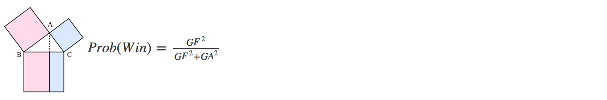
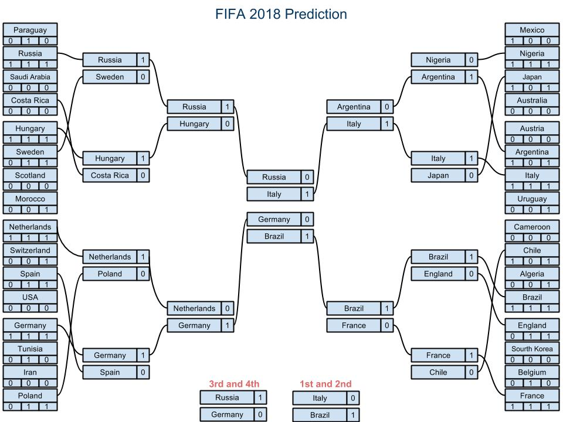

Summary
------------------

The aim of this project is to predict which countries are going to participate in the 2018 FIFA World Cup. Considering 32 teams including the host (Russia).  Also to sort them by using a simple Pythagorean model to predict how the tournament will unfold.

To simplify the problem we are going to consider several assumptions:
 
- Data collected from statistics of the 20 world cups only. Preliminary rounds should be consider to produce a better model but this surpasses the aim of this project.
- As is done in real live we are going to give points for each game played. This will provide 
  us with a weighed variable "points", which will have information of how many games each team 
  has won a game.
- The classification spots have changed over time, we are going to consider 32 teams in the classification from the 6 different regions distributed as is currently done. 
- We have to include Russia since it is the host country.

The sorting and win probability shows the champion of the tournament could be Brazil. The confidence of this estimation have to be further considered and can be a long problem. 


Data collection and sorting
------------------------------
There are a lot of data on the fifa world cup collected, all kinds of information are available for free. We are going to use only the general statistics about cups played, games played, scores of each game, number of cups attended and regions. The data was downloaded from  <https://github.com/footballdata/fifadata>. In particular the 'matches.csv' file.

```{r}
data<-read.csv("/Users/edana/Hudl/project_Hudl/fifadata/cup_stats_full.csv",
               stringsAsFactors = FALSE)

#Wrong values
data$region[25] = "Asia"
data$region[2] = "N/C.America"
```

However, in the 'matches.csv' file the information about the last world cup was missing, so the first step was to include all the information left out in the 'matches_full.csv'. With the information complete and correct, the data can be sorted to obtain useful information. The values needed are the points, 

- Winner = 3 points 
- Loser = 0 points 
- 1 point to each team if tied.    

and is also necessary the number of goals in favor (GF), the goals against (GA) and the number of participations in each cup.

This information is stored in the file but have to be processed to extract it, this process is much easier to do using a script. I wrote the ruby **data1.rb** script take cares of the organization of the data file and writes the 'cup_stats_full.csv'  

There are 32 spots for the 2018 World Cup, the number of available spots depend of the region each country belongs to, the classification table is:
```{r}
#Clasification table
regions <- unique(data$region)
regions <- regions[order(regions)]
number_spots <- c(5,4.5,13,3.5,0.5,4.5)
spots_df <- data.frame(regions,number_spots)
print(spots_df)
```

So the data has to be split by regions, then sorted to have the teams in each region with the most probability to be participating. Of course, one big influences of the probability to be in a specific cup can be derived from the preliminary rounds in each region but this can be considered if the project is extended.  

```{r}
data_africa = data[data$region == "Africa",]
data_asia = data[data$region == "Asia",]
data_europe = data[data$region == "Europe",]
data_ncAmerica = data[data$region == "N/C.America",]
data_oceania = data[data$region == "Oceania",]
data_sAmerica = data[data$region == "S.America",]
```

In general we want to see how many points a team has won, this depends also on how many cups the team has participated. And gives a clear indication of how good a team does in its cup participations. 

If the points are plotted as a function of the number of cups. There have been a total of 20 cups played. We can clearly see that the have a linear relation as we can see in the plot. The teams that have more participation have collected more points and viceversa the teams which less participation have collected few points.  

```{r, echo=FALSE}
library(ggplot2)
#General plot by region
qplot(editions,points, data = data,  col = region)
```


Analysis per region: Africa
--------------------------------------------
```{r, echo=FALSE}

library(plyr)
```

The African teams have has few participations over the years, only since 1998 the region has been assigned 5 spots when the total number of spots opened to 32 teams. So it is expected that the number of points the countries in this group have are significantly lower than other groups. A quick k-means clustering analysis applied shows two groups the low (1) and high (2) plotted in different colors. Cameroon has the lead followed by Nigeria.  

```{r}
#Analysis Africa
cluster_africa <- data.frame(data_africa[2],data_africa[3],data_africa[4],data_africa[5])
kmeans.result <- kmeans(cluster_africa, 2)
cluster_africa = cbind(data_africa$country, cluster_africa)
colnames(cluster_africa)[1] <- "country"
cluster_africa <- arrange(cluster_africa,desc(editions),desc(points))
teams_2018 = cluster_africa[1:floor(spots_df$number_spots[spots_df$regions == "Africa"]),]  
qplot(editions,points, data = data_africa, col = kmeans.result$cluster) +
    stat_smooth(method="lm", se=TRUE)

```
```{r}
lmfit <- lm(data_africa$editions ~ data_africa$points)
confint(lmfit)
```

The linear model fits the points, however the confidence interval is wide due to big variations the goodness of the fit is `r summary(lmfit)$r.squared`

Analysis per region: Asia
--------------------------------------------

The case of Asia is very similar to Africa in the sense that this group has only be assigned 4.5 spots since 2006, so there has been less chances for them to be in the cup. The clustering model does not show any particular separation. The lead team is South Korea with 9 participations. 

```{r}
#Analysis Asia
cluster_asia <- data.frame(data_asia[2],data_asia[3],data_asia[4],data_asia[5])
kmeans.result <- kmeans(cluster_asia, 2)
cluster_asia = cbind(data_asia$country,cluster_asia)
colnames(cluster_asia)[1] <- "country"
cluster_asia <- arrange(cluster_asia,desc(editions),desc(points))
teams_2018 = rbind(teams_2018, 
                   cluster_asia[1:floor(spots_df$number_spots[spots_df$regions == "Asia"]),])
qplot(editions,points, data = data_asia, col = kmeans.result$cluster) +
    stat_smooth(method="lm", se=TRUE)
```
```{r}
lmfit <- lm(data_asia$editions ~ data_asia$points)
confint(lmfit)
```

The linear model fit has a narrow confidence interval and the goodness of the fit is `r summary(lmfit)$r.squared`.


Analysis per region: Europe
--------------------------------------------

Europe has the most history on the cup and the most spots but counties as well. Very important is to remove the countries that have participated in the past but do not exist anymore. Countries like  *Federal Republic of Germany (FRG)*, *German Democratic Republic (GDR)*, *Yugoslavia*, *Czechoslovakia*, *Soviet Union* have to be removed from the data. Italy is the country with more participations and much more points than the others.

Since there are several points in this group, I applied the clustering algorithm with 3 center points to distinguish between the countries in the low (1), middle (2) and high (3) parts. 

```{r}
#Analysis Europe
data_europe <- data_europe[!(data_europe$country=="FRG"),]
data_europe <- data_europe[!(data_europe$country=="GDR"),]
data_europe <- data_europe[!(data_europe$country=="Yugoslavia"),]
data_europe <- data_europe[!(data_europe$country=="Czechoslovakia"),]
data_europe <- data_europe[!(data_europe$country=="Soviet Union"),]
cluster_europe <- data.frame(data_europe[2],data_europe[3],data_europe[4],data_europe[5])
kmeans.result <- kmeans(cluster_europe, 3)
cluster_europe = cbind(data_europe$country,cluster_europe)
colnames(cluster_europe)[1] <- "country"
cluster_europe <- arrange(cluster_europe,desc(editions),desc(points))
teams_2018 = rbind(teams_2018, 
                   cluster_europe[1:floor(spots_df$number_spots[spots_df$regions == "Europe"]),])
qplot(editions,points, data = data_europe, col = kmeans.result$cluster) +
    stat_smooth(method="lm", se=TRUE)
```
```{r}
lmfit <- lm(data_europe$editions ~ data_europe$points)
confint(lmfit)
```

The linear model fit has a narrow, also due to the high number of points we have for this regions. The confidence interval and the goodness of the fit is `r summary(lmfit)$r.squared`.


Analysis per region: North, Central America and the Caribbean
--------------------------------------------

This region includes just few countries, the best countries are Mexico and USA. The cluster algorithm shows a clearly this distinction. 

```{r}
#Analysis N/C.America
cluster_ncAmerica <- data.frame(data_ncAmerica[2],data_ncAmerica[3],
                                data_ncAmerica[4],data_ncAmerica[5])
kmeans.result <- kmeans(cluster_ncAmerica, 2)
cluster_ncAmerica = cbind(data_ncAmerica$country,cluster_ncAmerica)
colnames(cluster_ncAmerica)[1] <- "country"
cluster_ncAmerica <- arrange(cluster_ncAmerica,desc(editions),desc(points))
teams_2018 = rbind(teams_2018, 
                   cluster_ncAmerica[1:floor(spots_df$number_spots[spots_df$regions == "N/C.America"]),])
qplot(editions,points, data = data_ncAmerica, col = kmeans.result$cluster) +
    stat_smooth(method="lm", se=TRUE)
```
```{r}
lmfit <- lm(data_ncAmerica$editions ~ data_ncAmerica$points)
confint(lmfit)
```

The linear model fit has a narrow confidence interval and the goodness of the fit is `r summary(lmfit)$r.squared`.


Analysis per region: South America
--------------------------------------------

South america region has the country with the most participations over all, Brazil. In the group there is clearly the ditinction between Brazil and Argentina at the top, using the clustering algotithm. 

```{r}
#Analysis S.America
cluster_sAmerica <- data.frame(data_sAmerica[2],data_sAmerica[3],
                               data_sAmerica[4],data_sAmerica[5])
kmeans.result <- kmeans(cluster_sAmerica, 2)
cluster_sAmerica = cbind(data_sAmerica$country,cluster_sAmerica)
colnames(cluster_sAmerica)[1] <- "country"
cluster_sAmerica <- arrange(cluster_sAmerica,desc(editions),desc(points))
teams_2018 = rbind(teams_2018, 
                   cluster_sAmerica[1:floor(spots_df$number_spots[spots_df$regions == "S.America"]),])
qplot(editions,points, data = data_sAmerica, col = kmeans.result$cluster) +
    stat_smooth(method="lm", se=TRUE)
```
```{r}
lmfit <- lm(data_sAmerica$editions ~ data_sAmerica$points)
confint(lmfit)
```

The linear model fit has a narrow confidence interval and the goodness of the fit is `r summary(lmfit)$r.squared`.

Best teams selection
-------------------------------------------
From the region analysis we can obtain the top teams that could participate in the 2018 FIFA World Cup. There are specific number of spots assigned per region, however some of the numbers are not integer, what means is that one team from each 4 regions, with residuals 0.5, have the opportunity of get one of the 2 spots left. In this way we get 29 teams from before and now we will select the next 2 teams and finally add Russia to the list of teams competing.

```{r}
#Last teams
oceania <- data.frame(data_oceania[1],data_oceania[2],data_oceania[3],
                      data_oceania[4],data_oceania[5])
last_teams =  cluster_asia[5,]
last_teams =  rbind(last_teams,cluster_ncAmerica[4,])
last_teams =  rbind(last_teams,oceania)
last_teams =  rbind(last_teams,cluster_sAmerica[5,])
last_teams = arrange(last_teams,desc(editions),desc(points))
teams_2018 = rbind(teams_2018,last_teams[1:2,])

host <- data.frame("Russia",data[35,2],data[35,3],data[35,4],data[35,5])
colnames(host)[1] <- "country"
colnames(host)[2] <- "points"
colnames(host)[3] <- "gf"
colnames(host)[4] <- "ga"
colnames(host)[5] <- "editions"
teams_2018 = rbind(teams_2018,host)
```


Tournament prediction with Pythagorean Linear Model
-----------------------------------------------------


The list of 32 teams is complete. Now we have to see how the tournament will go considering who will win each game. There are several options that have been used for modeling a winning team. It highly depend on the sport and how the scoring is made. Basseball, basketball and Football have very different ways to keep the points. In the other hand, a winner team in soccer is very similar to hokey, where each goal is one point and the team that scores more goals wins. I have used a model Pythagorean Linear Model described for Hokey. <http://www.hockeyanalytics.com/Research_files/Win_Probabilities.pdf>

There are some short commings of this model.

- It does not consider ties. However, for the major part of the World Cup the games have to have a winner and a loser team, so it works for us.
- There is no parameter to adjust. Which means that is a very rigid model.
- It anly considers the weight of Goals in Favor (GF) and Goals Against (GA) and no other variable



The Pytagorean Model gives the probability for a team to win Prob(Win) based on the equation of a Pytagorean triangle as shown in the picture. Appliyng this formula to the data we can get for our selected 32 teams the win probability.

```{r}
teams_2018$win_prob = (teams_2018$gf*teams_2018$gf)/
    ((teams_2018$gf*teams_2018$gf) + (teams_2018$ga*teams_2018$ga))
```

It is important not to forget to randomize the order of the teams, like the lottery, to group the teams to compete againts each other.  

```{r}
#Randomize the teams
set.seed(42)
teams_2018=teams_2018[sample(nrow(teams_2018)),]
print(teams_2018)
```

Results
------------

Based on the calculated win probabilities we can create now the tournamet table. The teams have benn randomly arranged into 8 groups each of 4 teams. The first round each teams has to play 3 games against the other 3 teams of the group. After the team that has won all of the games (remember no ties considered) pass to the second round as the first of the group. Then the team that has won 2 of the games goes to be the second of the group. 

In the second round the first team plays against the second team of another group. Then the winner keeps going until the semifinals where 4 teams dispute the 4rd, 3rd, 2nd and 1st places.




