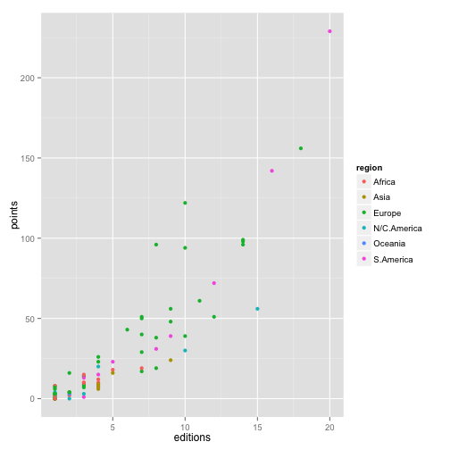
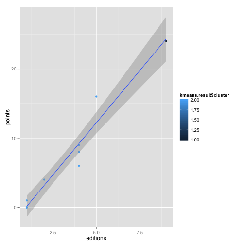
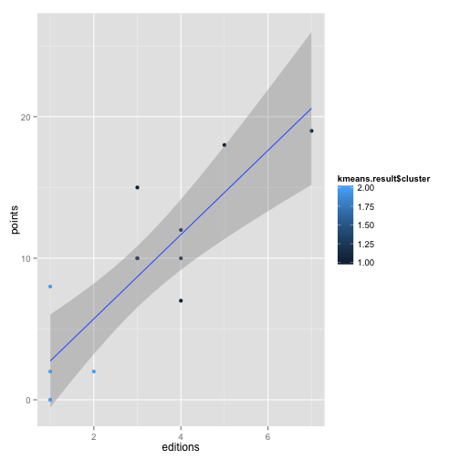
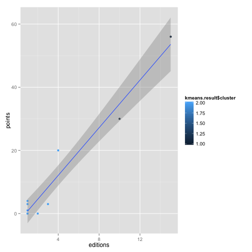
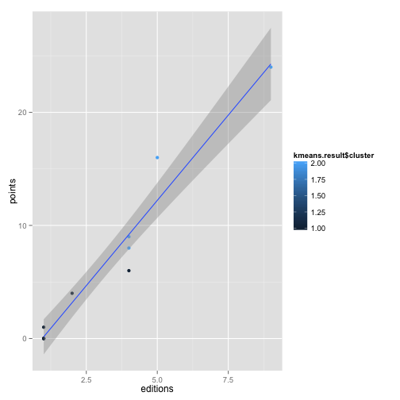

Summary
------------------

The aim of this project is to predict which countries are going to participate in the 2018 FIFA World Cup. And them by using a simple pitagorean model predict how will the tournament will 
unfold.

To simplify the problem we are going to consider several assumptions:
 
- Data collected from statistics of the 20 world cups only. Preliminary rounds should be consider to produce a better model but this surpases the aim of this project.
- As is done in real live we are going to give points for each game played. This will provide 
  us with a weithed variable "points", which will have information of how many games each team 
  has won a game.
    - Winner = 3 points 
    - Loser = 0 points 
    - 1 point to each team if tied.
- The clasification spots have changed over time, we are going to consider 32 teams in the clasification from the 6 different regions as is currently done. 

Since the 2018 FIFA World Cup will be held in Russia, 


```r
data<-read.csv("/Users/edana/Hudl/project_Hudl/fifadata/cup_stats_full.csv",
               stringsAsFactors = FALSE)

#Wrong values
data$region[25] = "Asia"
data$region[2] = "N/C.America"

data_africa = data[data$region == "Africa",]
data_asia = data[data$region == "Asia",]
data_europe = data[data$region == "Europe",]
data_ncAmerica = data[data$region == "N/C.America",]
data_oceania = data[data$region == "Oceania",]
data_sAmerica = data[data$region == "S.America",]

#Clasification table
regions <- unique(data$region)
regions <- regions[order(regions)]
number_spots <- c(5,4.5,13,3.5,0.5,4.5)
spots_df <- data.frame(regions,number_spots)
print(spots_df)
```

```
##       regions number_spots
## 1      Africa          5.0
## 2        Asia          4.5
## 3      Europe         13.0
## 4 N/C.America          3.5
## 5     Oceania          0.5
## 6   S.America          4.5
```

You can also embed plots, for example:

 

Note that the `echo = FALSE` parameter was added to the code chunk to prevent printing of the R code that generated the plot.

Analysis per region: Africa
--------------------------------------------


```r
#Analysis Africa
cluster_africa <- data.frame(data_africa[2],data_africa[3],data_africa[4],data_africa[5])
kmeans.result <- kmeans(cluster_africa, 2)
cluster_africa = cbind(data_africa$country, cluster_africa)
colnames(cluster_africa)[1] <- "country"
cluster_africa <- arrange(cluster_africa,desc(editions),desc(points))
teams_2018 = cluster_africa[1:floor(spots_df$number_spots[spots_df$regions == "Africa"]),]  
qplot(editions,points, data = data_africa, col = kmeans.result$cluster) +
    stat_smooth(method="lm", se=TRUE)
```

 


Analysis per region: Asia
--------------------------------------------

```r
#Analysis Asia
cluster_asia <- data.frame(data_asia[2],data_asia[3],data_asia[4],data_asia[5])
kmeans.result <- kmeans(cluster_asia, 2)
cluster_asia = cbind(data_asia$country,cluster_asia)
colnames(cluster_asia)[1] <- "country"
cluster_asia <- arrange(cluster_asia,desc(editions),desc(points))
teams_2018 = rbind(teams_2018, 
                   cluster_asia[1:floor(spots_df$number_spots[spots_df$regions == "Asia"]),])
qplot(editions,points, data = data_asia, col = kmeans.result$cluster) +
    stat_smooth(method="lm", se=TRUE)
```

 

Analysis per region: Europe
--------------------------------------------

```r
#Analysis Europe
data_europe <- data_europe[!(data_europe$country=="FRG"),]
data_europe <- data_europe[!(data_europe$country=="GDR"),]
data_europe <- data_europe[!(data_europe$country=="Yugoslavia"),]
data_europe <- data_europe[!(data_europe$country=="Czechoslovakia"),]
data_europe <- data_europe[!(data_europe$country=="Soviet Union"),]
cluster_europe <- data.frame(data_europe[2],data_europe[3],data_europe[4],data_europe[5])
kmeans.result <- kmeans(cluster_europe, 3)
cluster_europe = cbind(data_europe$country,cluster_europe)
colnames(cluster_europe)[1] <- "country"
cluster_europe <- arrange(cluster_europe,desc(editions),desc(points))
teams_2018 = rbind(teams_2018, 
                   cluster_europe[1:floor(spots_df$number_spots[spots_df$regions == "Europe"]),])
qplot(editions,points, data = data_europe, col = kmeans.result$cluster) +
    stat_smooth(method="lm", se=TRUE)
```

 


Analysis per region: North, Central America and the Caribean
--------------------------------------------

```r
#Analysis N/C.America
cluster_ncAmerica <- data.frame(data_ncAmerica[2],data_ncAmerica[3],
                                data_ncAmerica[4],data_ncAmerica[5])
kmeans.result <- kmeans(cluster_ncAmerica, 2)
cluster_ncAmerica = cbind(data_ncAmerica$country,cluster_ncAmerica)
colnames(cluster_ncAmerica)[1] <- "country"
cluster_ncAmerica <- arrange(cluster_ncAmerica,desc(editions),desc(points))
teams_2018 = rbind(teams_2018, 
                   cluster_ncAmerica[1:floor(spots_df$number_spots[spots_df$regions == "N/C.America"]),])
qplot(editions,points, data = data_ncAmerica, col = kmeans.result$cluster) +
    stat_smooth(method="lm", se=TRUE)
```

 


Analysis per region: South America
--------------------------------------------

```r
#Analysis S.America
cluster_sAmerica <- data.frame(data_sAmerica[2],data_sAmerica[3],
                               data_sAmerica[4],data_sAmerica[5])
kmeans.result <- kmeans(cluster_sAmerica, 2)
cluster_sAmerica = cbind(data_sAmerica$country,cluster_sAmerica)
colnames(cluster_sAmerica)[1] <- "country"
cluster_sAmerica <- arrange(cluster_sAmerica,desc(editions),desc(points))
teams_2018 = rbind(teams_2018, 
                   cluster_sAmerica[1:floor(spots_df$number_spots[spots_df$regions == "S.America"]),])
qplot(editions,points, data = data_sAmerica, col = kmeans.result$cluster) +
    stat_smooth(method="lm", se=TRUE)
```

 


Best teams selection
-------------------------------------------


```r
#Last teams
oceania <- data.frame(data_oceania[1],data_oceania[2],data_oceania[3],
                      data_oceania[4],data_oceania[5])
last_teams =  cluster_asia[5,]
last_teams =  rbind(last_teams,cluster_ncAmerica[4,])
last_teams =  rbind(last_teams,oceania)
last_teams =  rbind(last_teams,cluster_sAmerica[5,])
last_teams = arrange(last_teams,desc(editions),desc(points))
teams_2018 = rbind(teams_2018,last_teams[1:2,])

host <- data.frame("Russia",data[35,2],data[35,3],data[35,4],data[35,5])
colnames(host)[1] <- "country"
colnames(host)[2] <- "points"
colnames(host)[3] <- "gf"
colnames(host)[4] <- "ga"
colnames(host)[5] <- "editions"
teams_2018 = rbind(teams_2018,host)
```


Until know we have a list of 29 teams selected 


Tournamet predictions with Pitagorean Linear Model
-----------------------------------------------------
From the several options that have been used for modeling


$Prob(Win) = \frac{GF^2}{GF^2 + GA^2}$


```r
teams_2018$win_prob = (teams_2018$gf*teams_2018$gf)/
    ((teams_2018$gf*teams_2018$gf) + (teams_2018$ga*teams_2018$ga))
```


```r
#Randomize the teams
set.seed(42)
teams_2018=teams_2018[sample(nrow(teams_2018)),]
print(teams_2018)
```

```
##         country points  gf  ga editions win_prob
## 30     Paraguay     31  30  38        8  0.38396
## 32       Russia     51  53  34        7  0.70845
## 9  Saudi Arabia      8   9  32        4  0.07330
## 25   Costa Rica     20  22  27        4  0.39901
## 18      Hungary     48  87  57        9  0.69967
## 15       Sweden     61  74  69       11  0.53492
## 20     Scotland     19  25  41        8  0.27103
## 4       Morocco     10  12  18        4  0.30769
## 16  Netherlands     94  90  53       10  0.74251
## 17  Switzerland     39  45  59       10  0.36778
## 11        Spain     99  92  66       14  0.66022
## 24          USA     30  37  62       10  0.26261
## 19      Germany     96  93  44        8  0.81710
## 5       Tunisia      7   8  17        4  0.18130
## 31         Iran      6   7  22        4  0.09193
## 21       Poland     50  44  40        7  0.54751
## 23       Mexico     56  57  92       15  0.27738
## 2       Nigeria     18  20  26        5  0.37175
## 7         Japan     16  14  22        5  0.28824
## 8     Australia      9  11  26        4  0.15182
## 22      Austria     40  43  47        7  0.45564
## 27    Argentina    142 135  86       16  0.71133
## 10        Italy    156 128  77       18  0.73428
## 28      Uruguay     72  80  71       12  0.55939
## 1      Cameroon     19  18  43        7  0.14910
## 29        Chile     39  41  51        9  0.39257
## 3       Algeria     12  13  19        4  0.31887
## 26       Brazil    229 223 103       20  0.82417
## 12      England     98  79  56       14  0.66556
## 6   South Korea     24  31  67        9  0.17633
## 14      Belgium     51  52  66       12  0.38300
## 13       France     96 106  71       14  0.69030
```


