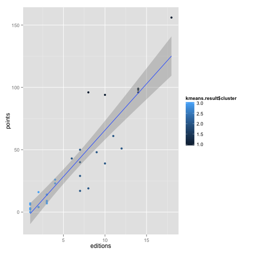
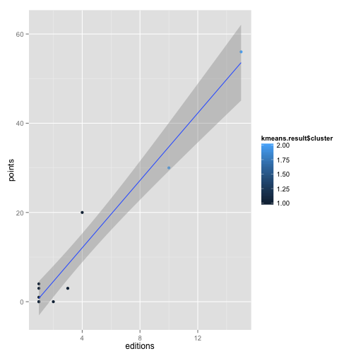
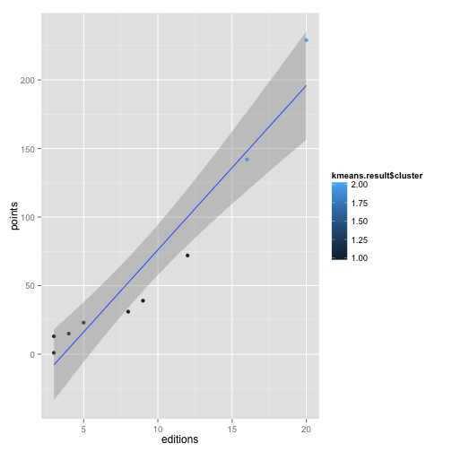

Summary
------------------

The aim of this project is to predict which countries are going to participate in the 2018 FIFA World Cup. Considering 32 teams including the host (Russia).  Also to sort them by using a simple Pythagorean model to predict how the tournament will unfold.

To simplify the problem we are going to consider several assumptions:
 
- Data collected from statistics of the 20 world cups only. Preliminary rounds should be consider to produce a better model but this surpasses the aim of this project.
- As is done in real live we are going to give points for each game played. This will provide 
  us with a weighed variable "points", which will have information of how many games each team 
  has won a game.
- The classification spots have changed over time, we are going to consider 32 teams in the classification from the 6 different regions distributed as is currently done. 
- We have to include Russia since it is the host country.

The sorting and win probability shows the champion of the tournament could be Brazil. The confidence of this estimation have to be further considered and can be a long problem. 


Data collection and Sorting
------------------------------
There are a lot of data on the fifa world cup collected, all kinds of information are available for free. We are going to use only the general statistics about cups played, games played, scores of each game, number of cups attended and regions. The data was downloaded from  <https://github.com/footballdata/fifadata>. In particular the 'matches.csv' file.


```r
data<-read.csv("/Users/edana/Hudl/project_Hudl/fifadata/cup_stats_full.csv",
               stringsAsFactors = FALSE)

#Wrong values
data$region[25] = "Asia"
data$region[2] = "N/C.America"
```

However, in the 'matches.csv' file the information about the last world cup was missing, so the first step was to include all the information left out in the 'matches_full.csv'. With the information complete and correct, the data can be sorted to obtain useful information. The values needed are the points, 

- Winner = 3 points 
- Loser = 0 points 
- 1 point to each team if tied.    

and is also necesary the number of goals in favor (GF), the goals againts (GA) and the number of participations in each cup.

This information is stored in the file but have to be processed to extract it, this process is much easier to do using a script. I wrote the ruby **data1.rb** script take cares of the organization of the data file and writes the 'cup_stats_full.csv'  

Thera are 32 spots for the 2018 World Cup, the number of available spots depend of the region each contry belongs to, the clasification table is:

```r
#Clasification table
regions <- unique(data$region)
regions <- regions[order(regions)]
number_spots <- c(5,4.5,13,3.5,0.5,4.5)
spots_df <- data.frame(regions,number_spots)
print(spots_df)
```

```
##       regions number_spots
## 1      Africa          5.0
## 2        Asia          4.5
## 3      Europe         13.0
## 4 N/C.America          3.5
## 5     Oceania          0.5
## 6   S.America          4.5
```

So the data has to be splited by regions, then sorted to have the teams in each region with the most probablity to be participating. Of course, one big influences of the probability to be in a specific cup can be derived from the preliminary rounds in each region but this can be considered if the project is extended.  


```r
data_africa = data[data$region == "Africa",]
data_asia = data[data$region == "Asia",]
data_europe = data[data$region == "Europe",]
data_ncAmerica = data[data$region == "N/C.America",]
data_oceania = data[data$region == "Oceania",]
data_sAmerica = data[data$region == "S.America",]
```

In general we want to see how many points a team has won, this depends also on how many cups the team has participated. And gives a clear indication of how good a team does in its cup participations. 

If the points are ploted as a function of the number of cups. There have been a total of 20 cups played. We can clearly see that the have a linear relation as we can see in the plot. The teams that have more participation have collected more points and viceversa the teams wich less participation have colected few points.  

 


Analysis per region: Africa
--------------------------------------------


The African teams have has few participations over the years, only since 1998 the region has been asigned 5 spots when the totla number of spots opened to 32 teams. So it is expected that the number of points the countries in this group have are significantly lower than other groups. A quick k-means clustering analysis applied shows two groups the low (1) and high (2) plotted in different colors. Cameroon has the lead followed by Nigeria.  


```r
#Analysis Africa
cluster_africa <- data.frame(data_africa[2],data_africa[3],data_africa[4],data_africa[5])
kmeans.result <- kmeans(cluster_africa, 2)
cluster_africa = cbind(data_africa$country, cluster_africa)
colnames(cluster_africa)[1] <- "country"
cluster_africa <- arrange(cluster_africa,desc(editions),desc(points))
teams_2018 = cluster_africa[1:floor(spots_df$number_spots[spots_df$regions == "Africa"]),]  
qplot(editions,points, data = data_africa, col = kmeans.result$cluster) +
    stat_smooth(method="lm", se=TRUE)
```

 

```r
lmfit <- lm(data_africa$editions ~ data_africa$points)
confint(lmfit)
```

```
##                      2.5 % 97.5 %
## (Intercept)        -0.1678 1.9695
## data_africa$points  0.1412 0.3418
```

The linear model fits the points, however the confidence interval is wide due to big variations the goodness of the fit is 0.7184

Analysis per region: Asia
--------------------------------------------

The case of Asia is very similar to Africa in the sense that this group has only be assigned 4.5 spots since 2006, so there has been less chances for them to be in the cup. The clusting model does not show any particular separation. The lead team is South Korea with 9 participations. 


```r
#Analysis Asia
cluster_asia <- data.frame(data_asia[2],data_asia[3],data_asia[4],data_asia[5])
kmeans.result <- kmeans(cluster_asia, 2)
cluster_asia = cbind(data_asia$country,cluster_asia)
colnames(cluster_asia)[1] <- "country"
cluster_asia <- arrange(cluster_asia,desc(editions),desc(points))
teams_2018 = rbind(teams_2018, 
                   cluster_asia[1:floor(spots_df$number_spots[spots_df$regions == "Asia"]),])
qplot(editions,points, data = data_asia, col = kmeans.result$cluster) +
    stat_smooth(method="lm", se=TRUE)
```

 

```r
lmfit <- lm(data_asia$editions ~ data_asia$points)
confint(lmfit)
```

```
##                   2.5 % 97.5 %
## (Intercept)      0.5397 1.5462
## data_asia$points 0.2646 0.3686
```

The linear model fit has a narrow confidence interval and the goodness of the fit is 0.9547.


Analysis per region: Europe
--------------------------------------------

Europe has the most history on the cup and the most spots but counties as well. Vey important is to remove the countries that have participated in the past but do not exist anymore. Contries like  *Federal Republic of Germany (FRG)*, *German Democratic Republic (GDR)*, *Yugoslavia*, *Czechoslovakia*, *Soviet Union* have to be removed from the data.

The linear model fit in this case has a good confidence interval


```r
#Analysis Europe
data_europe <- data_europe[!(data_europe$country=="FRG"),]
data_europe <- data_europe[!(data_europe$country=="GDR"),]
data_europe <- data_europe[!(data_europe$country=="Yugoslavia"),]
data_europe <- data_europe[!(data_europe$country=="Czechoslovakia"),]
data_europe <- data_europe[!(data_europe$country=="Soviet Union"),]
cluster_europe <- data.frame(data_europe[2],data_europe[3],data_europe[4],data_europe[5])
kmeans.result <- kmeans(cluster_europe, 3)
cluster_europe = cbind(data_europe$country,cluster_europe)
colnames(cluster_europe)[1] <- "country"
cluster_europe <- arrange(cluster_europe,desc(editions),desc(points))
teams_2018 = rbind(teams_2018, 
                   cluster_europe[1:floor(spots_df$number_spots[spots_df$regions == "Europe"]),])
qplot(editions,points, data = data_europe, col = kmeans.result$cluster) +
    stat_smooth(method="lm", se=TRUE)
```

 

```r
lmfit <- lm(data_europe$editions ~ data_europe$points)
confint(lmfit)
```

```
##                      2.5 % 97.5 %
## (Intercept)        1.01578 2.9462
## data_europe$points 0.09352 0.1303
```

The linear model fit has a narrow, also due to the high number of points we have for this regions. The confidence interval and the goodness of the fit is 0.8323.


Analysis per region: North, Central America and the Caribbean
--------------------------------------------

```r
#Analysis N/C.America
cluster_ncAmerica <- data.frame(data_ncAmerica[2],data_ncAmerica[3],
                                data_ncAmerica[4],data_ncAmerica[5])
kmeans.result <- kmeans(cluster_ncAmerica, 2)
cluster_ncAmerica = cbind(data_ncAmerica$country,cluster_ncAmerica)
colnames(cluster_ncAmerica)[1] <- "country"
cluster_ncAmerica <- arrange(cluster_ncAmerica,desc(editions),desc(points))
teams_2018 = rbind(teams_2018, 
                   cluster_ncAmerica[1:floor(spots_df$number_spots[spots_df$regions == "N/C.America"]),])
qplot(editions,points, data = data_ncAmerica, col = kmeans.result$cluster) +
    stat_smooth(method="lm", se=TRUE)
```

 

```r
lmfit <- lm(data_ncAmerica$editions ~ data_ncAmerica$points)
confint(lmfit)
```

```
##                          2.5 % 97.5 %
## (Intercept)           -0.04378 1.9547
## data_ncAmerica$points  0.20441 0.2989
```

The linear model fit has a narrow confidence interval and the goodness of the fit is 0.9496.


Analysis per region: South America
--------------------------------------------

```r
#Analysis S.America
cluster_sAmerica <- data.frame(data_sAmerica[2],data_sAmerica[3],
                               data_sAmerica[4],data_sAmerica[5])
kmeans.result <- kmeans(cluster_sAmerica, 2)
cluster_sAmerica = cbind(data_sAmerica$country,cluster_sAmerica)
colnames(cluster_sAmerica)[1] <- "country"
cluster_sAmerica <- arrange(cluster_sAmerica,desc(editions),desc(points))
teams_2018 = rbind(teams_2018, 
                   cluster_sAmerica[1:floor(spots_df$number_spots[spots_df$regions == "S.America"]),])
qplot(editions,points, data = data_sAmerica, col = kmeans.result$cluster) +
    stat_smooth(method="lm", se=TRUE)
```

 

```r
lmfit <- lm(data_sAmerica$editions ~ data_sAmerica$points)
confint(lmfit)
```

```
##                       2.5 %  97.5 %
## (Intercept)          2.1463 5.99417
## data_sAmerica$points 0.0565 0.09701
```

The linear model fit has a narrow confidence interval and the goodness of the fit is 0.9198.


Best teams selection
-------------------------------------------


```r
#Last teams
oceania <- data.frame(data_oceania[1],data_oceania[2],data_oceania[3],
                      data_oceania[4],data_oceania[5])
last_teams =  cluster_asia[5,]
last_teams =  rbind(last_teams,cluster_ncAmerica[4,])
last_teams =  rbind(last_teams,oceania)
last_teams =  rbind(last_teams,cluster_sAmerica[5,])
last_teams = arrange(last_teams,desc(editions),desc(points))
teams_2018 = rbind(teams_2018,last_teams[1:2,])

host <- data.frame("Russia",data[35,2],data[35,3],data[35,4],data[35,5])
colnames(host)[1] <- "country"
colnames(host)[2] <- "points"
colnames(host)[3] <- "gf"
colnames(host)[4] <- "ga"
colnames(host)[5] <- "editions"
teams_2018 = rbind(teams_2018,host)
```


Until know we have a list of 29 teams selected 


Tournament predictions with Pythagorean Linear Model
-----------------------------------------------------
From the several options that have been used for modeling


$Prob(Win) = \frac{GF^2}{GF^2 + GA^2}$


```r
teams_2018$win_prob = (teams_2018$gf*teams_2018$gf)/
    ((teams_2018$gf*teams_2018$gf) + (teams_2018$ga*teams_2018$ga))
```


```r
#Randomize the teams
set.seed(42)
teams_2018=teams_2018[sample(nrow(teams_2018)),]
print(teams_2018)
```

```
##         country points  gf  ga editions win_prob
## 30     Paraguay     31  30  38        8  0.38396
## 32       Russia     51  53  34        7  0.70845
## 9  Saudi Arabia      8   9  32        4  0.07330
## 25   Costa Rica     20  22  27        4  0.39901
## 18      Hungary     48  87  57        9  0.69967
## 15       Sweden     61  74  69       11  0.53492
## 20     Scotland     19  25  41        8  0.27103
## 4       Morocco     10  12  18        4  0.30769
## 16  Netherlands     94  90  53       10  0.74251
## 17  Switzerland     39  45  59       10  0.36778
## 11        Spain     99  92  66       14  0.66022
## 24          USA     30  37  62       10  0.26261
## 19      Germany     96  93  44        8  0.81710
## 5       Tunisia      7   8  17        4  0.18130
## 31         Iran      6   7  22        4  0.09193
## 21       Poland     50  44  40        7  0.54751
## 23       Mexico     56  57  92       15  0.27738
## 2       Nigeria     18  20  26        5  0.37175
## 7         Japan     16  14  22        5  0.28824
## 8     Australia      9  11  26        4  0.15182
## 22      Austria     40  43  47        7  0.45564
## 27    Argentina    142 135  86       16  0.71133
## 10        Italy    156 128  77       18  0.73428
## 28      Uruguay     72  80  71       12  0.55939
## 1      Cameroon     19  18  43        7  0.14910
## 29        Chile     39  41  51        9  0.39257
## 3       Algeria     12  13  19        4  0.31887
## 26       Brazil    229 223 103       20  0.82417
## 12      England     98  79  56       14  0.66556
## 6   South Korea     24  31  67        9  0.17633
## 14      Belgium     51  52  66       12  0.38300
## 13       France     96 106  71       14  0.69030
```


